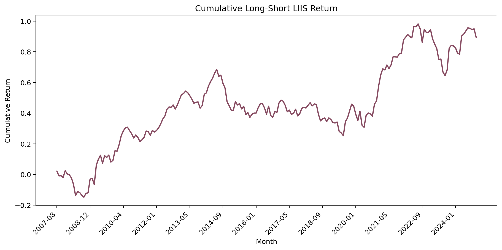
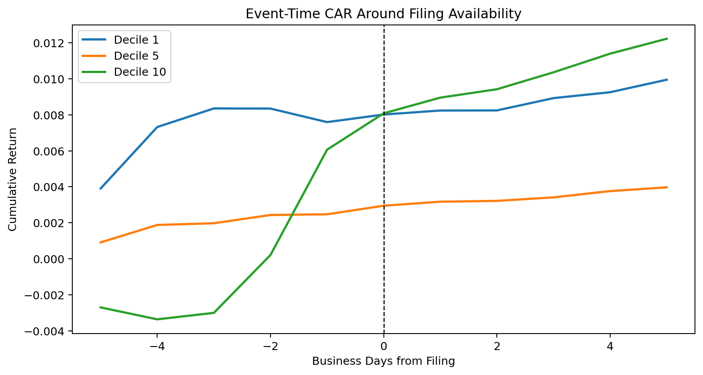
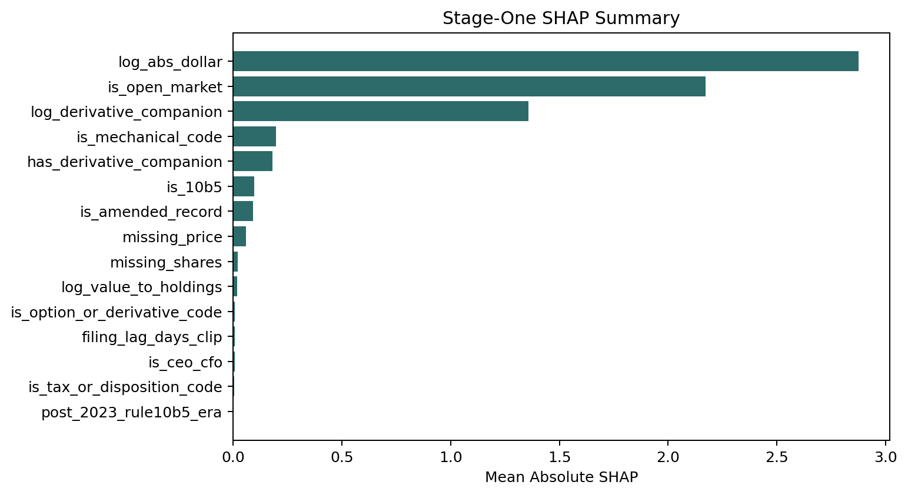
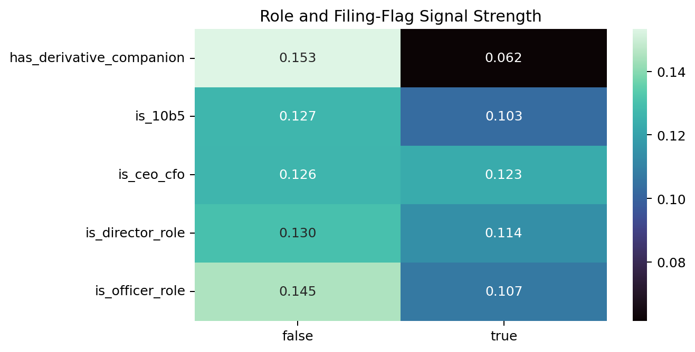
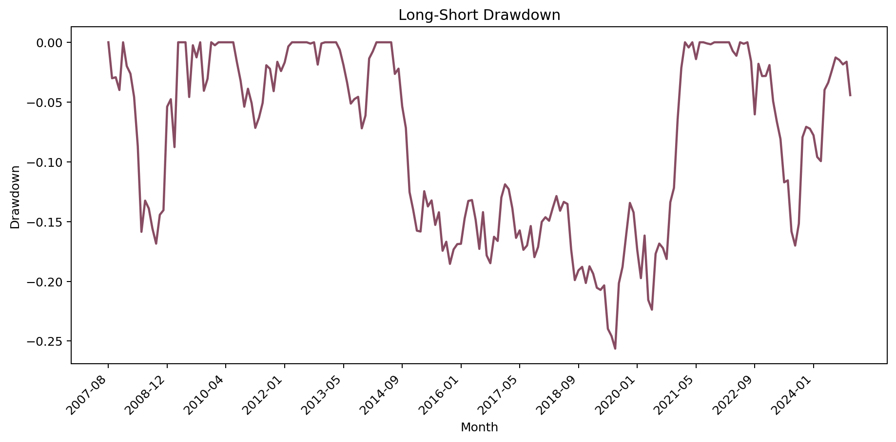
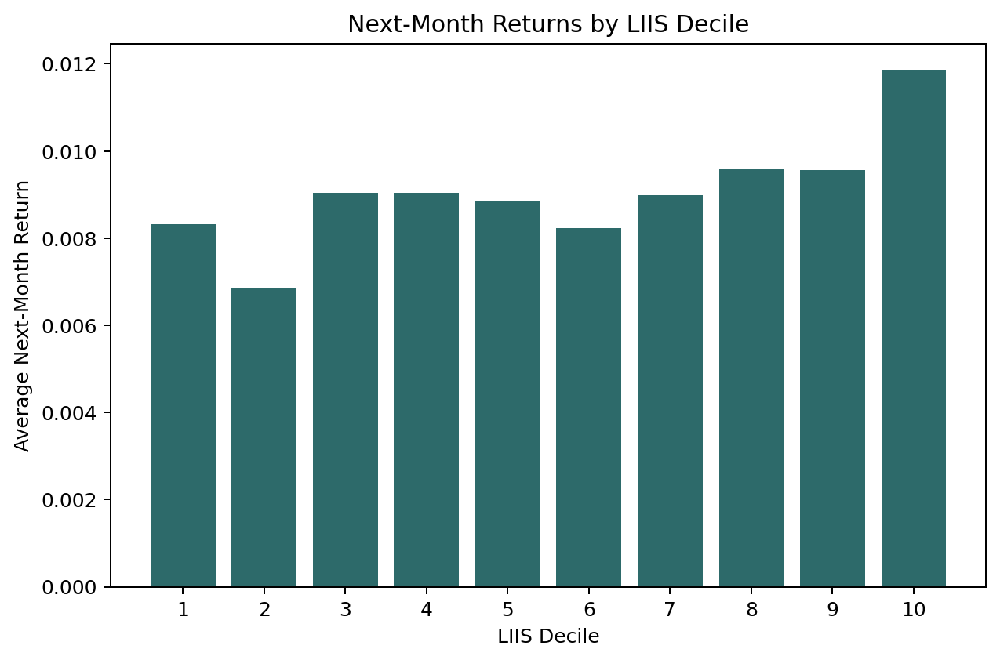
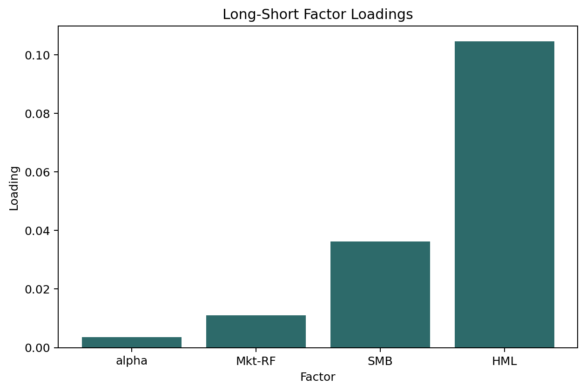

# Latent Insider Information Shocks

[](https://github.com/NimaTaheri1378/latent-insider-information-shocks/actions/workflows/ci.yml)
[](https://github.com/NimaTaheri1378/latent-insider-information-shocks/actions/workflows/pages.yml)
[](requirements.txt)
[](docs/results.md)
[](DATA_ACCESS.md)
[](artifacts/tables/model_variant_table.csv)

## Can insider filings predict returns after we remove the routine trades?

**Answer:** yes, but only after the filing stream is de-noised at the transaction
level. A raw Form 4 signal mixes open-market information trades with planned
10b5-1 sales, grants, vesting, option exercises, tax withholding, amendments,
and derivative-linked activity. This project learns which transactions look
economically informative, aggregates them into firm-month shocks, and tests
whether those shocks price the equity cross-section.

In the production run, the main LIIS long-short earns **0.38% per month**
with a **t-stat of 1.94** over 203 months. The cleaner non-10b5 subset earns
**0.42% per month** with a **t-stat of 2.20**. The result is not a black-box
demo: it is a full point-in-time WRDS pipeline, asset-pricing backtest,
robustness battery, event study, explainability layer, and recruiter-facing
research site scaffold.



## What I Built

This repository combines:

- **Point-in-time data engineering:** WRDS Thomson Reuters Insiders, CRSP,
  CRSP/Compustat linking, Compustat annual/quarterly controls, daily CRSP event
  windows, and Fama/French factors.
- **Transaction-level de-noising:** Form 4 transaction code families, filing
  lags, officer/director roles, derivative companions, amendments, 10b5-1
  indicators, size scaling, and missingness diagnostics.
- **Model variants:** rules baseline, Elastic Net benchmark, LightGBM tabular
  model, A100 PyTorch MLP extension, SHAP summaries, and a blended production
  score.
- **Asset-pricing tests:** decile portfolios, long-short returns, Fama-MacBeth-
  style regressions, factor loadings, event-time CAR, drawdown, performance, and
  robustness checks.
- **Delivery:** public summary tables, static figures, HTML companions, MkDocs
  pages, CI, and reproducibility tests.

## Headline Results

| Quantity | Result |
| --- | ---: |
| Insider transactions scored | 17,328,988 |
| Mapped transaction rows in PERMNO backtest | 11,624,607 |
| Firm-month panel rows | 390,627 |
| Backtest months | 203 |
| Main LIIS mean long-short return | 0.38% per month |
| Main LIIS t-stat | 1.94 |
| Non-10b5 LIIS t-stat | 2.20 |
| Event-window observations | 939,844 |
| Robustness tests | 10 |
| Final score source | LightGBM CPU + torch GPU MLP blend |

## Result Figures

<table>
  <tr>
    <td></td>
    <td></td>
  </tr>
  <tr>
    <td></td>
    <td></td>
  </tr>
  <tr>
    <td></td>
    <td></td>
  </tr>
</table>

More figures are in [`artifacts/figures_static`](artifacts/figures_static), and
HTML companions are in [`artifacts/figures_html`](artifacts/figures_html).

## What The Signal Is Capturing

The strongest stage-one drivers are transaction size, open-market status, and
derivative-companion structure. That is economically sensible: the model is
rewarding trades that look discretionary and material, while discounting
transactions that look mechanical, pre-planned, derivative-linked, or purely
compensation related.

The robustness table is intentionally blunt:

| Test | Mean long-short | t-stat |
| --- | ---: | ---: |
| Main LIIS net | 0.38% | 1.94 |
| Non-10b5 only | 0.42% | 2.20 |
| Open-market only | 0.28% | 1.50 |
| Amendment strict | 0.38% | 1.92 |
| Placebo shuffle within month | 0.13% | 1.28 |

See [`artifacts/tables/robustness_summary.csv`](artifacts/tables/robustness_summary.csv)
for the full battery.

## Repository Map

```text
scripts/
  liis_pipeline.py              # full WRDS-to-results production pipeline
  make_interactive_figures.py   # HTML companions from public CSV tables
  build_docs_assets.py          # copy public artifacts into MkDocs
  public_safety_scan.py         # pre-publish guardrail
configs/
  pipeline.yml                  # sample window, WRDS libraries, model split
artifacts/
  tables/                       # publishable summary tables
  figures_static/               # PDF/SVG/PNG result figures
  figures_html/                 # self-contained HTML companions
docs/
  proposal_coverage.md          # proposal-to-artifact ledger
  run_status.md                 # final run evidence
tests/
  test_public_artifacts.py      # public artifact and guardrail tests
```

## Reproduce

The public repo includes the main scripts and summary outputs. A full rerun
requires WRDS access for Thomson Reuters Insiders, CRSP, CCM, and Compustat.
WRDS row-level extracts and processed proprietary panels are not redistributed.

Install the research environment:

```bash
python -m pip install -r requirements.txt
```

Run local checks:

```bash
python scripts/public_safety_scan.py
python -m unittest discover -s tests
python scripts/make_interactive_figures.py
```

Run the pipeline phases on a compute node with WRDS credentials configured:

```bash
python scripts/liis_pipeline.py --root . --phase extract
python scripts/liis_pipeline.py --root . --phase features
python scripts/liis_pipeline.py --root . --phase models
python scripts/liis_pipeline.py --root . --phase backtest
python scripts/liis_pipeline.py --root . --phase figures
```

On Amarel, use the SLURM helpers in [`jobs/`](jobs/).
